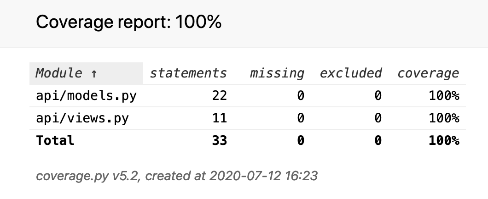

# Projeto para obter a cotação da moeda a partir do site do Banco Central

Neste projeto iremos, através de um webservice, consultar a moeda de melhor cotação em uma determinada frente ao dólar americano.

## Problema:

Todos os dias a empresa precisa saber qual moeda possui a menor cotação frente ao dólar. Essa informação é importante para uma outra aplicação de ranking de moedas que eles irão desenvolver.

## Solução:

Visto que esta aplicação desenvolvida será utilizada por outra aplicação no futuro, procurei desenvolver de forma que ela já esteja preparada para a integração futura. O projeto está estruturado da seguinte forma:

- Na camada mais alta foi desenvolvida uma API que possui um endpoint para, ao ser chamado, realizar o download do arquivo de cotações na data solicitada através do site do Banco Central. Sendo assim, obterá a melhor cotação frente ao dólar americano e retornará as informações solicitadas;

- Para este primeiro momento foi criado um script que será um comando personalizado do django-admin chamado 'get_cotation.py', no qual possui uma interface com o usuario. Ele será o responsável por chamar o endpoint da API e obter a melhor cotação, retornando a informação na tela para o usuário;

- Uma tabela de lookup, aonde o script acima irá pegar os dados de símbolo da moeda e nome do país no qual esta moeda pertence;

- Foram criados dois modelos de dados, que neste primeiro momento não estão sendo utilizados. Eles servião quando for necessário armazenar os dados adquiridos. O primeiro modelo serve para armazenar a melhor cotação diária e o segundo modelo serve para armazenar todas as cotações obtidas de uma determinada data.

## Como utilizar este projeto:

Para executar o script via terminal, basta acessar a pasta do ambiente virtual e executar o comando abaixo:
-python manage.py get_cotation

Se quiser fazer uma requisição via Get na API, segue abaixo o endpoint criado:

- Endpoint: http://127.0.0.1:8000/api/v1/get_cotation/{data para pesquisa}
- Ex: http://127.0.0.1:8000/api/v1/get_cotation/20200706

## Testes automáticos com o coverage:

### Para executar os testes:
- coverage run manage.py test
- coverage report